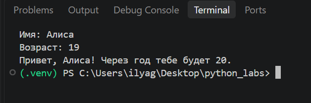
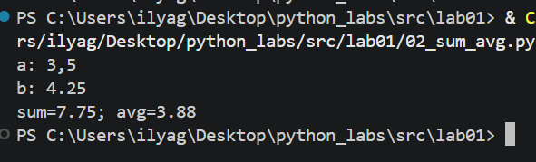
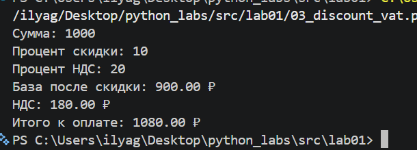
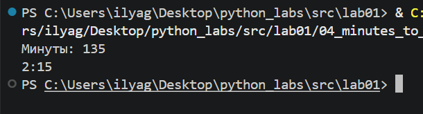
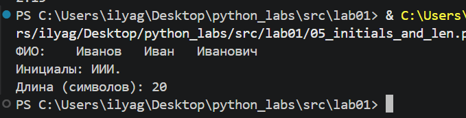
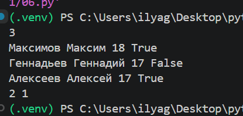
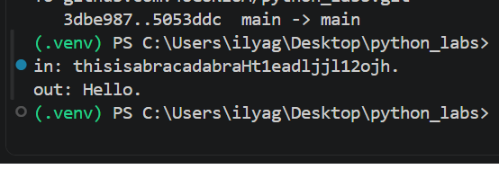

# Лабораторная работа №1
## Ввод/вывод и форматирование

В лабораторной работе рассмотрены основные операции ввода и вывода данных в Python, работа с числовыми и строковыми типами данных, форматирование вывода, обработка строк и использование циклов.

---

## Структура проекта

```text
python_labs/
├── README.md
├── src/
│   └── lab01/
│       ├── 01_greeting.py
│       ├── 02_sum_avg.py
│       ├── 03_discount_vat.py
│       ├── 04_minutes_to_hhmm.py
│       ├── 05_initials_and_len.py
│       ├── 06.py
│       └── 07.py
└── images/
    └── lab01/
        ├── 01_greeting.png
        ├── 02_sum_avg.png
        ├── 03_discount_vat.png
        ├── 04_minutes_to_hhmm.png
        ├── 05_initials_and_len.png
        ├── 06.png
        └── 07.png
```

---

# Задания

## Задание 1 — Привет и возраст

Программа запрашивает имя и возраст пользователя, после чего выводит приветствие и сообщает, сколько лет пользователю будет через год.

### Запуск

```bash
python src/lab01/01_greeting.py
```

### Результат работы программы



---

## Задание 2 — Сумма и среднее

Программа принимает два вещественных числа. При вводе допускается использование как точки, так и запятой в качестве десятичного разделителя.

Программа вычисляет:

- сумму двух чисел;
- среднее арифметическое.

Результаты выводятся с двумя знаками после десятичной точки.

### Запуск

```bash
python src/lab01/02_sum_avg.py
```

### Результат работы программы



---

## Задание 3 — Чек: скидка и НДС

Программа принимает:

- исходную стоимость;
- размер скидки в процентах;
- размер НДС в процентах.

Сначала рассчитывается стоимость после применения скидки:

```text
base = price × (1 - discount / 100)
```

Затем рассчитывается величина НДС:

```text
vat_amount = base × (vat / 100)
```

Итоговая стоимость:

```text
total = base + vat_amount
```

Все денежные значения выводятся с двумя знаками после десятичной точки.

### Запуск

```bash
python src/lab01/03_discount_vat.py
```

### Результат работы программы



---

## Задание 4 — Минуты → ЧЧ:ММ

Программа принимает целое количество минут и преобразует его в формат:

```text
ЧЧ:ММ
```

Количество часов определяется целочисленным делением на `60`, а оставшиеся минуты — остатком от деления на `60`.

Минуты выводятся минимум двумя цифрами.

### Запуск

```bash
python src/lab01/04_minutes_to_hhmm.py
```

### Результат работы программы



---

## Задание 5 — Инициалы и длина строки

Программа принимает ФИО одной строкой.

В процессе обработки:

- удаляются лишние пробелы;
- определяются первые буквы фамилии, имени и отчества;
- формируются инициалы в верхнем регистре;
- рассчитывается длина строки без лишних пробелов.

### Запуск

```bash
python src/lab01/05_initials_and_len.py
```

### Результат работы программы



---

# Задания со звёздочкой

## Задание 6* — Подсчёт участников

На вход программы подаётся количество участников `N`.

После этого вводится `N` строк следующего формата:

```text
Фамилия Имя Возраст Формат_участия
```

Формат участия задаётся булевым значением:

- `True` — очный формат;
- `False` — заочный формат.

Программа подсчитывает количество участников каждого формата и выводит два числа:

```text
<очно> <заочно>
```

### Запуск

```bash
python src/lab01/06.py
```

### Результат работы программы



---

## Задание 7* — Расшифровка строки

Программа получает зашифрованную строку без пробелов и восстанавливает исходную строку по заданным признакам.

Для восстановления используются следующие условия:

1. Первая заглавная буква зашифрованной строки является первым символом исходной строки.
2. Символы исходной строки расположены с постоянным шагом.
3. Второй символ исходной строки находится сразу после цифры.
4. Последним символом исходной строки является точка `.`.

После определения позиций первого и второго символов вычисляется шаг, с которым из зашифрованной строки извлекаются остальные символы.

### Запуск

```bash
python src/lab01/07.py
```

### Результат работы программы



---

## Используемые средства

- Python 3
- Visual Studio Code
- Git
- GitHub

---

## Запуск программ

Для запуска отдельного задания необходимо находиться в корневой директории репозитория `python_labs`.

Например:

```bash
python src/lab01/01_greeting.py
```

Для Windows также можно использовать:

```powershell
py src/lab01/01_greeting.py
```