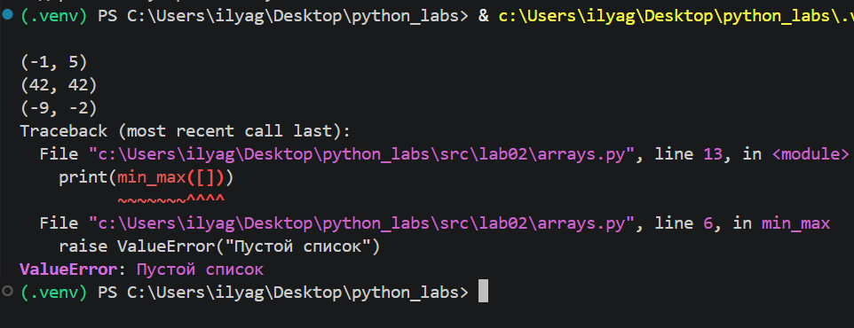
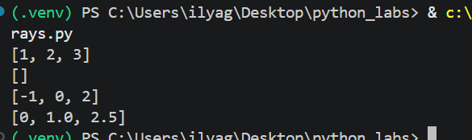
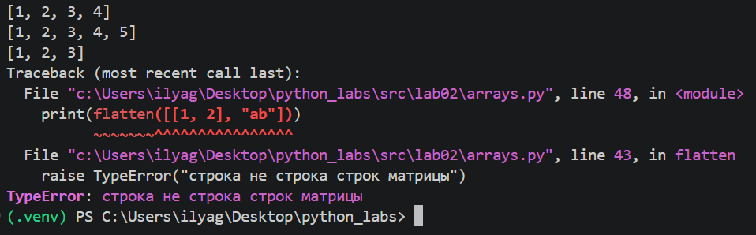
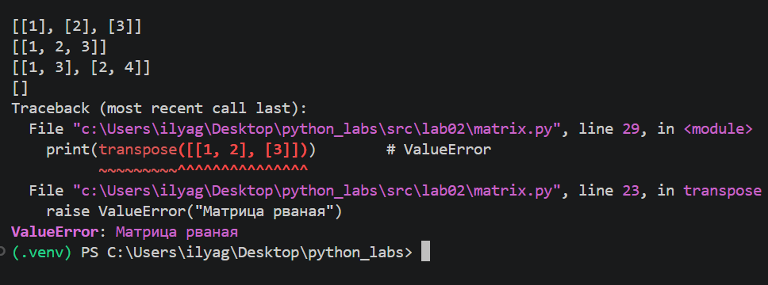
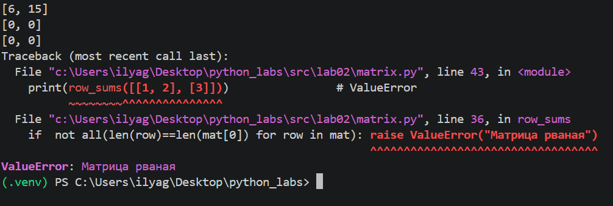
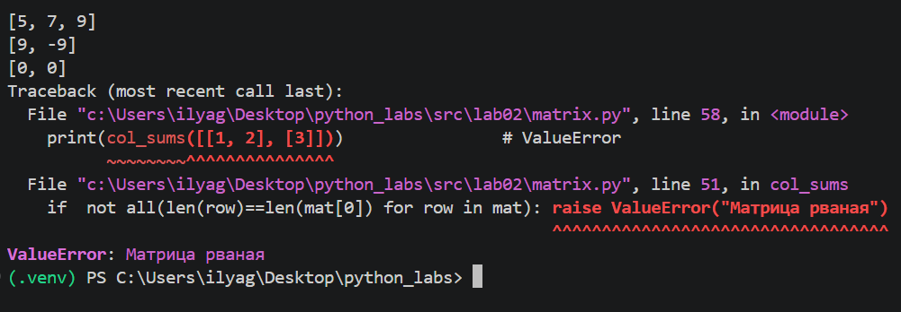
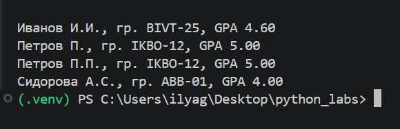

# Лабораторная работа №2
## Коллекции и матрицы (list/tuple/set/dict)

В лабораторной работе рассмотрена работа со списками, кортежами, множествами и двумерными списками в Python. Реализованы функции для обработки массивов, работы с матрицами и форматирования записи студента.

---

## Структура проекта

```text
python_labs/
├── src/
│   ├── lab01/
│   └── lab02/
│       ├── README.md
│       ├── arrays.py
│       ├── matrix.py
│       └── tuples.py
└── images/
    ├── lab01/
    └── lab02/
        ├── arrays_01.png
        ├── arrays_02.png
        ├── arrays_03.png
        ├── matrix_01.png
        ├── matrix_02.png
        ├── matrix_03.png
        └── tuples.png
```

---

# Задание 1 — `arrays.py`

В файле `arrays.py` реализованы функции для работы со списками.

## 1. `min_max`

Функция принимает список чисел и возвращает кортеж из минимального и максимального значений.  
Если список пустой, вызывается `ValueError`.

### Пример

```python
print(min_max([3, -1, 5, 5, 0]))
print(min_max([42]))
print(min_max([-5, -2, -9]))
print(min_max([1.5, 2, 2.0, -3.1]))
print(min_max([]))
```

### Запуск

```bash
python src/lab02/arrays.py
```

### Результат работы функции



---

## 2. `unique_sorted`

Функция удаляет повторяющиеся элементы списка и возвращает уникальные значения, отсортированные по возрастанию.

### Пример

```python
print(unique_sorted([3, 1, 2, 1, 3]))
print(unique_sorted([]))
print(unique_sorted([-1, -1, 0, 2, 2]))
print(unique_sorted([1.0, 1, 2.5, 2.5, 0]))
```

### Запуск

```bash
python src/lab02/arrays.py
```

### Результат работы функции



---

## 3. `flatten`

Функция объединяет вложенные списки и кортежи в один список в порядке следования элементов.  
Если один из элементов верхнего уровня не является списком или кортежем, вызывается `TypeError`.

### Пример

```python
print(flatten([[1, 2], [3, 4]]))
print(flatten([[1, 2], (3, 4, 5)]))
print(flatten([[1], [], [2, 3]]))
print(flatten([1,2],["ab"]))
```

### Запуск

```bash
python src/lab02/arrays.py
```

### Результат работы функции



---

# Задание B — `matrix.py`

В файле `matrix.py` реализованы функции для работы с прямоугольными матрицами.

## 1. `transpose`

Функция транспонирует матрицу: строки становятся столбцами, а столбцы — строками.  
Для рваной матрицы вызывается `ValueError`.

### Пример

```python
print(transpose([[1, 2, 3]]))
print(transpose([[1], [2], [3]]))
print(transpose([[1, 2], [3, 4]]))
print(transpose([]))
print(transpose([1,2],[3]))
```

### Запуск

```bash
python src/lab02/matrix.py
```

### Результат работы функции



---

## 2. `row_sums`

Функция вычисляет сумму элементов каждой строки матрицы.

### Пример

```python
print(row_sums([[1, 2, 3], [4, 5, 6]]))
print(row_sums([[-1, 1], [10, -10]]))
print(row_sums([[0, 0], [0, 0]]))
```

### Запуск

```bash
python src/lab02/matrix.py
```

### Результат работы функции



---

## 3. `col_sums`

Функция вычисляет сумму элементов каждого столбца матрицы.

### Пример

```python
print(col_sums([[1, 2, 3], [4, 5, 6]]))
print(col_sums([[-1, 1], [10, -10]]))
print(col_sums([[0, 0], [0, 0]]))
```

### Запуск

```bash
python src/lab02/matrix.py
```

### Результат работы функции



---

# Задание C — `tuples.py`

В файле `tuples.py` реализована работа с записью студента в виде кортежа:

```python
(fio, group, gpa)
```

## `format_record`

Функция принимает ФИО, группу и средний балл студента.  
Лишние пробелы в ФИО удаляются, имя и отчество преобразуются в инициалы, а GPA выводится с двумя знаками после точки.

### Пример

```python
print(format_record(("Иванов Иван Иванович", "BIVT-25", 4.6)))
print(format_record(("Петров Пётр", "IKBO-12", 5.0)))
print(format_record(("Петров Пётр Петрович", "IKBO-12", 5.0)))
print(format_record(("  сидорова  анна   сергеевна ", "ABB-01", 3.999)))
```

### Запуск

```bash
python src/lab02/tuples.py
```

### Результат работы функции



---

## Используемые средства

- Python 3.11+
- Visual Studio Code
- Git
- GitHub

---

## Запуск программ

Для запуска заданий необходимо находиться в корневой директории репозитория `python_labs`.

Например:

```bash
python src/lab02/arrays.py
python src/lab02/matrix.py
python src/lab02/tuples.py
```

Для Windows также можно использовать:

```bash
py src/lab02/arrays.py
py src/lab02/matrix.py
py src/lab02/tuples.py
```
