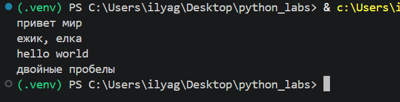
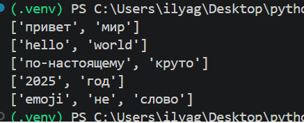
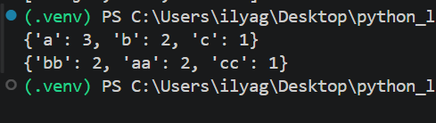
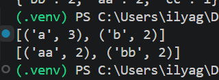
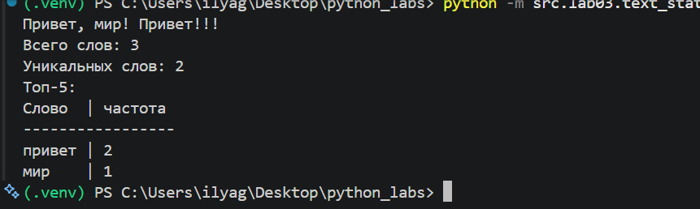
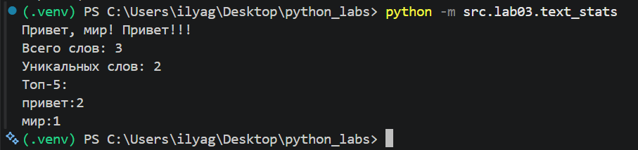

# Лабораторная работа №3 — Тексты и частоты слов

## Цель работы

Научиться обрабатывать строки в Python: нормализовать текст, разбивать его на слова, подсчитывать частоту слов с помощью словаря и выводить наиболее часто встречающиеся слова.

В работе используются только возможности стандартной библиотеки Python.

## Структура

```text
python_labs/
├── src/
│   ├── lib/
│   │   └── text.py
│   └── lab03/
│       ├── text_stats.py
│       └── README.md
└── images/
    └── lab03/
        ├── img01.png
        ├── img02.png
        ├── img03.png
        ├── img04.png
        ├── img05.png
        └── img06.png
```

---

## Задание A — модуль `text.py`

В модуле реализованы четыре функции:

- `normalize()` — нормализация текста;
- `tokenize()` — разбиение текста на отдельные слова;
- `count_freq()` — подсчёт частоты каждого слова;
- `top_n()` — получение наиболее часто встречающихся слов.

### Код `src/lib/text.py`

```python
def normalize(text: str, *, casefold: bool = True, yo2e: bool = True) -> str:
    Comtext = text
    if yo2e:
        Comtext = Comtext.replace("ё", "е").replace("Ё", "Е")
    if casefold:
        Comtext = Comtext.casefold()

    Comtext = ' '.join(Comtext.split())
    return Comtext

print(normalize("ПрИвЕт\nМИр\t"))# привет мир
print(normalize("ёжик, Ёлка", yo2e=True))# ежик, елка
print(normalize("Hello\r\nWorld"))# hello world
print(normalize("  двойные   пробелы  "))# двойные пробелы

def tokenize(text: str) -> list[str]:
    Comtext = text
    Comtext = normalize(Comtext)
    result = ""
    count = 0

    for i in Comtext:
        if i.isalnum() or (
            (i == "-" or i == '_')
            and count > 0 and count + 1 < len(Comtext)
            and Comtext[count - 1].isalnum() and Comtext[count + 1].isalnum()
        ): result += i
        else:result += " "

        count += 1

    return result.split()

# print(tokenize("привет мир"))  # ["привет", "мир"]
# print(tokenize("hello,world!!!"))  # ["hello", "world"]
# print(tokenize("по-настоящему круто"))  # ["по-настоящему", "круто"]
# print(tokenize("2025 год"))  # ["2025", "год"]
# print(tokenize("emoji 😀 не слово"))  # ["emoji", "не", "слово"]

def count_freq(tokens: list[str]) -> dict[str, int]:
    t = tokens
    result = {}
    for words in t:
        result[words] = t.count(words)
    return result


# print(count_freq(["a", "b", "a", "c", "b", "a"]))  # {"a": 3, "b": 2, "c": 1}
# print(count_freq(["bb", "aa", "bb", "aa", "cc"]))  # {"aa": 2, "bb": 2, "cc": 1}

def top_n(freq: dict[str, int], n: int = 5) -> list[tuple[str, int]]:
    result = list(freq.items()) #.items - делает словарь парами(слово-колво)
    result.sort(key=lambda x: (-x[1], x[0]))
    return result[:n]

# print(top_n({"a": 3, "b": 2, "c": 1}, n=2))  # [('a', 3), ('b', 2)]
# print(top_n({"bb": 2, "aa": 2, "cc": 1}, n=2))  # [('aa', 2), ('bb', 2)]
```

### Проверка `normalize()`

Использованные тесты:

```python
print(normalize("ПрИвЕт\nМИр\t"))  # привет мир
print(normalize("ёжик, Ёлка", yo2e=True))  # ежик, елка
print(normalize("Hello\r\nWorld"))  # hello world
print(normalize("  двойные   пробелы  "))  # двойные пробелы
```

Результат:

```text
привет мир
ежик, елка
hello world
двойные пробелы
```



### Проверка `tokenize()`

Использованные тесты:

```python
print(tokenize("привет мир"))  # ["привет", "мир"]
print(tokenize("hello,world!!!"))  # ["hello", "world"]
print(tokenize("по-настоящему круто"))  # ["по-настоящему", "круто"]
print(tokenize("2025 год"))  # ["2025", "год"]
print(tokenize("emoji 😀 не слово"))  # ["emoji", "не", "слово"]
```

Результат:

```text
['привет', 'мир']
['hello', 'world']
['по-настоящему', 'круто']
['2025', 'год']
['emoji', 'не', 'слово']
```



### Проверка `count_freq()`

Использованные тесты:

```python
print(count_freq(["a", "b", "a", "c", "b", "a"]))
print(count_freq(["bb", "aa", "bb", "aa", "cc"]))
```

Результат:

```text
{'a': 3, 'b': 2, 'c': 1}
{'bb': 2, 'aa': 2, 'cc': 1}
```



### Проверка `top_n()`

Использованные тесты:

```python
print(top_n({"a": 3, "b": 2, "c": 1}, n=2))
print(top_n({"bb": 2, "aa": 2, "cc": 1}, n=2))
```

Результат:

```text
[('a', 3), ('b', 2)]
[('aa', 2), ('bb', 2)]
```

При одинаковой частоте слова сортируются по алфавиту.



---

## Задание B — `text_stats.py`

Скрипт получает строку из стандартного ввода, последовательно вызывает функции из `text.py`, после чего выводит:

- общее количество слов;
- количество уникальных слов;
- топ-5 слов по частоте.

Также реализован дополнительный табличный режим. Он включается константой:

```python
TABLE = 1
```

При значении `1` топ выводится таблицей. Если установить `TABLE = 0`, используется обычный формат `слово:количество`.

### Код `src/lab03/text_stats.py`

```python
from src.lib.text import normalize, tokenize, top_n, count_freq

TABLE = 1 #Для включения режима таблички


def text_stat(text: str):
    t = text

    tokens = tokenize(normalize(t))
    freq = count_freq(tokens)
    top = top_n(freq)

    print(f"Всего слов: {len(tokens)}")
    print(f"Уникальных слов: {len(freq)}")
    print("Топ-5:")

    if TABLE:
        max_word_len = max( max((len(i[0]) for i in top), default=0), len("Слово") )

        print("Слово" + " " * (max_word_len - len("Слово")) + " | частота")
        print("-" * (max_word_len + 11))

        for i in top:
            print(i[0] + " " * (max_word_len - len(i[0])) + f" | {i[1]}")

    else:
        for i in top:
            print(f"{i[0]}:{i[1]}")

text = input()
text_stat(text)
```

### Пример запуска

Запуск из корня проекта:

```powershell
python -m src.lab03.text_stats
```

Пример ввода:

```text
Привет, мир! Привет!!!
```

Результат:

```text
Всего слов: 3
Уникальных слов: 2
Топ-5:
Слово  | частота
-----------------
привет | 2
мир    | 1
```



### Обычный режим вывода

При отключённом табличном режиме (`TABLE = 0`) программа выводит топ слов в формате `слово:частота`.

Пример:

```text
Привет, мир! Привет!!!
Всего слов: 3
Уникальных слов: 2
Топ-5:
привет:2
мир:1
```




---

## Вывод

В ходе лабораторной работы была реализована обработка текста: нормализация строки, выделение слов, подсчёт их частоты и сортировка по количеству повторений. Для хранения частот использовался словарь. Также был реализован вывод пяти наиболее частых слов и дополнительный табличный режим.
