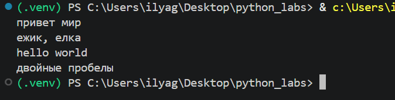
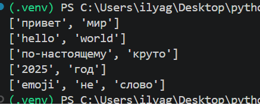
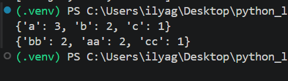
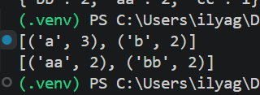
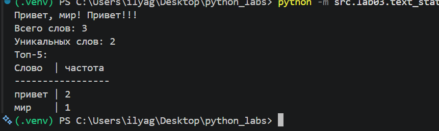
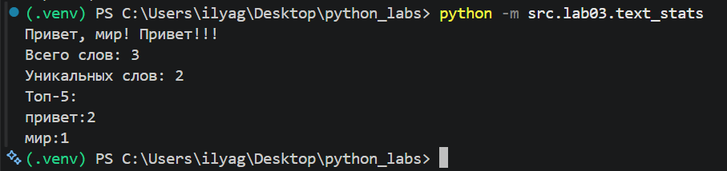

# Лабораторная работа №3 — тексты и частоты слов

Цель работы — нормализовать текст, выделить слова, посчитать частоты
словарём и вывести топ-N. Используется только стандартная библиотека Python.

## Структура

```text
src/lib/text.py             # normalize, tokenize, count_freq, top_n
src/lab03/text_stats.py     # программа со stdin
src/lab03/README.md          # отчёт
images/lab03/img01.png ...  # скриншоты проверок
```

## Задание A — `src/lib/text.py`

Реализованы функции:

```python
def normalize(text: str, *, casefold: bool = True, yo2e: bool = True) -> str
def tokenize(text: str) -> list[str]
def count_freq(tokens: list[str]) -> dict[str, int]
def top_n(freq: dict[str, int], n: int = 5) -> list[tuple[str, int]]
```

`normalize` применяет `casefold()` (или `lower()`), заменяет `ё` на `е`,
превращает `\\t`, `\\r`, `\\n` в пробелы, схлопывает пробелы и обрезает края.
`tokenize` использует шаблон `\\w+(?:-\\w+)*`: цифры и подчёркивания
считаются частью слова, дефис разрешён внутри слова. `top_n` сортирует пары
по ключу `(-частота, слово)`.

### Проверки

```python
from src.lib.text import count_freq, normalize, tokenize, top_n

assert normalize("ПрИвЕт\nМИр\t") == "привет мир"
assert normalize("ёжик, Ёлка") == "ежик, елка"
assert normalize("Hello\r\nWorld") == "hello world"
assert tokenize("по-настоящему foo_bar 2025 😀") == [
    "по-настоящему", "foo_bar", "2025"
]
assert count_freq(["a", "b", "a", "c", "b", "a"]) == {
    "a": 3, "b": 2, "c": 1
}
assert top_n({"bb": 2, "aa": 2, "cc": 1}, 2) == [
    ("aa", 2), ("bb", 2)
]
```

Результаты проверок:









## Задание B — `src/lab03/text_stats.py`

Программа читает весь stdin до EOF, нормализует текст и печатает:

```text
Всего слов: <N>
Уникальных слов: <K>
Топ-5:
слово:количество
```

Запуск из корня проекта:

```powershell
"Привет, мир! Привет!!!" | python -m src.lab03.text_stats
```

Результат:

```text
Всего слов: 3
Уникальных слов: 2
Топ-5:
привет:2
мир:1
```

Также поддерживается прямой запуск:

```powershell
"Привет, мир! Привет!!!" | python src/lab03/text_stats.py
```

Дополнительный табличный режим включается переменной окружения:

```powershell
$env:TEXT_STATS_TABLE = "1"
"Привет, мир! Привет!!!" | python -m src.lab03.text_stats
```

Скриншоты запуска:





## Вывод

Реализованы нормализация, токенизация с поддержкой дефисов,
подсчёт частот и детерминированная сортировка топа. Функции модуля не
выполняют ввод-вывод и могут использоваться в следующих лабораторных работах.
